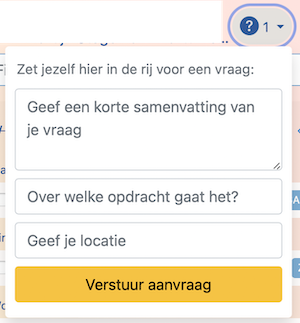

# Programmeren 2

## Studiewijzer <small>Lente 2025</small>

Wat ga je doen?

- De verschillende programmeerstijlen in Python beheersen.
- Leren hoe je je eigen programma's op kwaliteit kunt toetsen en verbeteren.
- Kennis maken met abstracte datatypes in diverse vormen.
- Implementeren van verschillende datastructuren op basis van Python classes.
- Begrijpen waarom sommige algoritmen "beter" werken dan andere.
- Analyseren hoe goed een algoritme werkt gegeven een bepaalde datastructuur.
- Leren hoe je maatregelen kunt nemen in code om latere fouten te voorkomen.

Bij dit vak werk je aan verschillende soorten **opdrachten**. De meeste opdrachten doe je individueel. Soms zijn het oefeningen, dan weer schrijf je een flink groot programma en op een aantal momenten ga je met tools aan de slag om te leren je Python-code zelf beter te maken.

## Docenten en assistenten

De docenten bij dit vak zijn Jelle van Assema en Martijn Stegeman. Zij geven het vak vorm en verzorgen de organisatie. Je kunt ze bereiken via e-mail op <help@mprog.nl>.

## Ingangseisen

Je moet Programmeren 1 volledig hebben gehaald om dit vak te mogen volgen.

## Opdrachten en aftekenen

Hieronder vind je de **deadlines**. Bij dit vak is het niet verplicht om alle opdrachten af te maken. Wel zijn de deadlines hard. Na het verstrijken van de deadline is er dus géén mogelijkheid meer om in te leveren.

| Week | Module              | Punten | Ster |        Deadline |                              |
| ---- | ------------------- | :----: | :--: | --------------: | ---------------------------- |
| 1    | Python              |   6    |  1   | do 2 apr  17:00 | let op goede vrijdag         |
| 2    | Collections         |   6    |  2   | vr 10 apr 17:00 | let op paasmaandag           |
| 3    | Objects             |   2    |  -   | vr 17 apr 17:00 |                              |
| 3    | Abstract data types |   4    |  2   | vr 17 apr 17:00 | zelfde deadline!             |
| 4    | Container classes   |   4    |  1   | vr 24 apr 17:00 |                              |
| 4+5  | Linked structures   |   4    |  -   | vr 24 apr 17:00 | zelfde deadline!             |
| 5    | Restricted lists    |   4    |  -   | vr 8  mei 17:00 | 4/5 mei roostervrij          |
| 6+7  | Object graphs       |   12   |  -   | do 21 mei 17:00 | vrijdag = start tentamenweek |
|      | **Totaal punten:**  |   42   |  6   |                 |                              |

**Fulltime** --- Doe je tegelijk met dit vak het Programmeerproject? Dan doe je de minor programmeren in fulltime en bieden we een andere indeling van de twee vakken aan. Je doet dan eerst grotendeels programmeren 2 en daarna het programmeerproject in vier weken. Het schema ziet er dan zo uit:

| Week              | Maandag           | Dinsdag             | Woensdag              | Donderdag             | Vrijdag                |
| ----------------- | ----------------- | ------------------- | --------------------- | --------------------- | ---------------------- |
| -1 (blok 4)       |                   |                     |                       |                       | Python                 |
| 0 (blok 4)        | Python            | **Tentamen DR**     | Collections           | Collections           | Objects                |
| 1                 | ADT               | ADT                 | **Finance (project)** | **Finance (project)** | ✝ (vrij)               |
| 2                 | 🐣 (vrij)         | Containers          | Containers            | **Hertentamen DR**    | Linked                 |
| 3                 | Linked            | **Books (project)** | **Books (project)**   | **Books (project)**   | Restricted             |
| 4                 | Restricted        | Restricted          | Graphs                | Graphs                | Graphs                 |
| 5 (vrij) |                   |                     |                       |                       |                        |
| 6                 | 4 mei (vrij)      | 5 mei (vrij)        | Graphs                | Graphs                | Tentamen!              |
| 7                 | **project**       | **project**         | **project**           | Hemelvaart (vrij)     | Dag na hemelvaart (vrij) |
| 8                 | **project**       | **project**         | **project**           | **project**           | **project**            |
| 9                 | pinksteren (vrij) | Hertentamen prog2   | **project**           | **project**           | **projectpresentatie** |

De deadlines blijven hetzelfde als bij het reguliere schema. Dat betekent dat de mogelijkheid blijft bestaan om te wisselen naar het reguliere schema bijvoorbeeld in geval van ziekte. Dit heeft vaak wel de consequentie dat er te weinig tijd overblijft om ook het programmeerproject te volgen in hetzelfde blok en je dat vak zal moeten laten vallen. Het is daarom extra belangrijk voor fulltime studenten om goed contact te houden bij bijvoorbeeld ziekte, zo kunnen we je het beste helpen.

Bij verschillende modules zijn er opdrachten gemarkeerd met een `*`. Dit zijn **steropdrachten**, bedoeld als extra uitdaging en dus ook voor diegenen die daarnaar op zoek zijn. Als je ze niet maakt mis je slechts een bescheiden aantal punten.

## Eindcijfer

De eindbeoordeling gaat als volgt:

1.  Je maakt de **meesterproef** (tentamen). Hierin werk je een groter stuk Python-code uit, en je vult dit aan met allerlei technieken uit de cursus, zoals automatische tests. De meesterproef moet voldoende zijn om het vak te kunnen halen. Bij de meesterproef focussen we op een basisniveau, met een paar geavanceerdere onderdelen.

2.  Je hebt een **eindgesprek** kort na de meesterproef. Hier bespreken we jouw uitwerkingen van zowel de proef als je huiswerkopdrachten. Je resultaat bij de proef ondersteunt de beoordeling van het huiswerk. Zo kunnen de docenten constateren dat je alles goed hebt begrepen en dat de huiswerkopdrachten kunnen meetellen.

3.  Het **eindcijfer** bestaat dan uit de punten voor de opdrachten. Het wordt berekend via:

        behaalde_punten / maximum * 9 + 1

    De steropdrachten wegen mee in het puntentotaal en dus ook in het eindcijfer. Per saldo maken de opdrachten met een `*` het verschil tussen een 9 (dus 8.875 maar dan afgerond) en een 10.

Het moet goed mogelijk zijn een groot deel van de opdrachten helemaal af te maken, mits je wekelijks genoeg tijd reserveert voor het vak.

## Aanwezigheid

Jouw aanwezigheid wordt verwacht bij de bijeenkomsten die in het rooster vermeld staan (voor fulltime-studenten is dit elke werkdag 10-16 uur). De aanwezigheid wordt bijgehouden om een goed beeld te vormen van je regelmatige inzet voor het vak.

Mocht je onverhoopt een keer niet kunnen, dan stuur je even een mailtje. Dit hoeft zeker niet via de studieadviseur, je mag het gewoon direct bij ons melden.

Heb je meer systematisch problemen met aanwezig zijn, bespreek het dan even. Er is best wat mogelijk, maar voor ons is het belangrijk dat we de studenten op vaste momenten in de week kunnen zien en begeleiden, om de werkdruk redelijk te houden. Daarom is die aanwezigheid voor ons zo belangrijk.

Als je wegblijft tijdens het vak, hou er dan rekening mee dat er weinig flexibiliteit is om alternatieve begeleiding te geven en dat er geen uitzonderingen worden verleend op de standaardregels (denk aan deadlines).

### Ziekte en inhalen

Als je ziek bent, meld het dan even aan je docenten (niet je studieadviseur) via een e-mail naar <mailto:help@mprog.nl>. Je hoeft het niet uitgebreid uit te leggen, maar wel meteen melden. Het contact hierover houden is het belangrijkste dat je kunt doen.

- Ben je één of twee dagen ziek dan is dat geen probleem en kun je de deadline vaak nog halen. Het kan handig zijn om even te overleggen op welke opdrachten je je het best kunt richten.

- Heb je een medisch noodgeval en ben je hierdoor bijvoorbeeld een hele week uit de running? Dan bespreek je naderhand met een docent hoe je dit kunt oplossen, bijvoorbeeld door een klein deel van de opdrachten nog te doen zodat je kennis op peil is.

    Daarbij speelt natuurlijk ook mee hoe makkelijk het programmeren je afgaat en hoeveel energie je hebt. Op basis van al die informatie kijken we samen wat mogelijk is. Je krijgt ook bij inhalen geen punten voor de opdrachten; het is echt gericht om snel weer mee te doen met de groep.

## Vragen stellen

Tijdens dit vak zul je vaak de hulp inroepen van de assistenten en medestudenten. Er zijn diverse opties voor het stellen van vragen. De beste optie hangt af van het soort vraag dat je wil stellen.

**Medestudenten:** eerste hulp bij vastlopen.

- jouw eerste aanspreekpunt zijn je medestudenten in het lokaal
- ook als parttime-student moet je zorgen dat je toegang hebt tot andere studenten
- samen nadenken over de opdracht helpt je verder
- controleer met elkaar je uitwerkingen, bijvoorbeeld door ideeën voor tests te delen
- de beste manier is om vaak in het lokaal te komen zitten

**Assistentie:** direct contact met een assistent, voor hulp bij programmeren.

- hulp op locatie (lokaal L0.09)
- je weet echt niet waar te beginnen of een onvindbare bug, of alles loopt vast
- moeite met verzinnen oplossing
- dagelijks beschikbaar na 10 uur, zet jezelf in de rij via het menu:

    

**E-mail:** contact met de docenten.

- maken van persoonlijke planningsafspraken
- meedenken over grote problemen met het vak
- andere officiële zaken
- administratie na afloop van het vak
- mail <help@mprog.nl>

Kom je helemaal niet verder en heb je even geen hulp?

Juist even niet aan de opdracht werken kan je verder helpen!

- Neem een halfuurtje echt even afstand van je computer; dit helpt je brein afstand nemen van het probleem. Met een frisse blik kom je dan toch weer verder.

- Ga even door met de volgende opdracht van de module om te kijken hoe je daar mee gaat.

## Regels voor samenwerken, plagiaat en ChatGPT

De basis van alles wat je inlevert moet jouw eigen denkwerk zijn.

### Samenwerken

Natuurlijk is het nuttig om bij het maken van individuele opdrachten **interactie** te hebben met je medestudenten, en dat kan ook enorm helpen bij het beheersen van de stof. Maar er is een grens tussen het vragen van hulp aan een ander en het inleveren van werk van een ander. Hieronder karakteriseren we beide kanten van die grens.

Je mag niet samenwerken aan de **implementatie** van je programma's (dus het bedenken welke code je moet intikken). Uitzondering is dat je medestudenten om hulp mag vragen, zolang dat er niet op neer komt dat een ander een deel van het werk voor jou doet. Over het algemeen mag je, als je om hulp vraagt, jouw code laten zien, maar kijk je niet naar de code van een ander. Je laat je dus niks voorzeggen.

Waar de grens **onduidelijk** is vragen we je om "redelijk" te handelen. Hieronder vind je een incomplete lijst van voorbeelden die een beeld schetsen van welke handelingen we als redelijk of onredelijk bestempelen. Twijfel je of een handeling redelijk is, vraag het, en wacht tot je per e-mail toestemming hebt gekregen van een docent (niet assistent). Als je onredelijk handelt dan kan dit leiden tot een melding bij de examencommissie.

Voorbeelden van **redelijke** acties

- Praten met medestudenten over de opdrachten in het Nederlands (of een andere natuurlijke taal).

- Het cursusmateriaal bespreken met anderen om het beter te begrijpen.

- Een medestudent helpen bij het debuggen tijdens een laptopcollege of daarbuiten, of zelfs online, door het bekijken, compileren of draaien van zijn of haar code, zelfs op je eigen computer.

- Het in je uitwerking opnemen van een paar regels code die je online of ergens anders vindt, gegeven dat deze regels niet de essentie van de opdracht vormen en dat je de bron van de code vermeldt.

- Het inzien van tentamens van voorgaande jaren en oplossingen daarvan.

- Code die jij hebt geschreven versturen of laten zien aan iemand anders, wellicht een medestudent, zodat deze jou kan helpen bij het debuggen.

- Het online delen van een paar regels van jouw code zodat anderen wellicht kunnen helpen met debuggen.

- Een aan het vak verbonden assistent om hulp vragen.

- Naar het internet gaan voor tutorials buiten het vak, voor referenties, en voor oplossingen bij technische problemen, maar niet voor gehele oplossingen voor (de essentie van) opdrachten.

- Het uittekenen of uitwerken van oplossingen op een whiteboard door middel van diagrammen of pseudocode, maar niet "echte" code.

- Werken met (en zelfs betalen voor) een tutor om je te helpen met het vak, gegeven dat de tutor niet het werk voor je doet.

Voorbeelden van **onredelijke** acties

- Een oplossing van een opdracht inzien voordat je jouw opdracht hebt ingeleverd.

- Een medestudent vragen om hun oplossing, voordat je jouw opdracht hebt ingeleverd.

- Het decompileren, deobfusceren, of op andere manier achterhalen van een "staff" oplossing van een opdracht.

- Vergeten de bron te citeren van code of technieken die je hebt opgenomen van buiten de lessen van dit vak, en hebt geïntegreerd in je eigen werk, zelfs als je wel de andere restricties aanhoudt.

- Het aan een medestudent geven of laten zien van een oplossing voor een opdracht waar hij of zij (dus niet jij) moeite mee heeft.

- Betalen, of het aanbieden om te betalen, voor het recht om werk van een ander als onderdeel van jouw eigen werk in te leveren.

- Het beschikbaar stellen van oplossingen voor opdrachten van dit vak aan anderen die dit vak in de toekomst wellicht gaan volgen.

- Het opzoeken van complete oplossingen voor opdrachten online of ergens anders.

- Werk van een opdracht opsplitsen met een ander.

- Werk van een ander, behalve een paar regels zoals eerder omschreven, inleveren.

- Hetzelfde of bijna hetzelfde werk inleveren bij dit vak dat je hebt ingeleverd of gaat inleveren bij een ander vak.

- Het inleveren van werk voor dit vak, waarbij je intentie is om dit ook ergens anders voor in te zetten (zeg voor een baan), zonder daar eerst toestemming voor te hebben gekregen van een docent.

- Naar de oplossing voor een opdracht van iemand anders kijken, en vervolgens jouw oplossing daarop baseren.

### Plagiaat

Alle inzendingen worden wekelijks gecontroleerd met behulp van een detectiesysteem dat zoekt naar overeenkomsten in programmacode. Dat kunnen overeenkomsten zijn binnen de groep, met studenten van vorige jaren, of zelfs met code van internet.

Vinden we overeenkomsten, dan gaat een docent direct met je in gesprek om je voor te lichten en om af te spreken hoe je het vak zonder plagiëren kunt halen. Is er een **vermoeden van plagiaat**, dan moet dit gemeld worden bij de examencommissie.

In alle gevallen is het ons doel om dit soort situaties te voorkomen, omdat ze niet leerzaam zijn en veel werk opleveren voor iedereen. Vraag daarom vooral om advies als je denkt dat het misgaat! Er is vaak meer te redden dan je denkt, zelfs al is de deadline nabij.

De [fraude- en plagiaatregeling](https://student.uva.nl/onderwerpen/plagiaat-en-fraude) van de Universiteit van Amsterdam geeft algemene aanwijzingen over plagiaat en andere vormen van fraude en is de basis voor bovenstaande regelingen.

### ChatGPT en andere LLM's

Hoewel LLM's bijzonder goed zijn in programmeren, zeker waar het kleine opdrachten betreft, kun je als student zelf niet beoordelen of het echt goed is zonder zelf te leren programmeren. Als jij code van een LLM overneemt zonder gedegen kennis, loop je het risico bugs en security-leaks over te nemen zonder dat je er erg in hebt. En als je wil bijdragen aan grotere software-projecten, dan merk je zonder deze kennis en ervaring dat je het overzicht niet kan houden.

Bij deze cursus is het gebruik van ChatGPT dus ook niet toegestaan voor het genereren van (delen van) oplossingen voor de opdrachten, eigenlijk precies zoals je geen oplossingen van andere studenten mag overnemen, zoals hierboven vermeld. Als je dit toch doet wordt het gezien als fraude. Bij een vermoeden van fraude moet dit door de docent worden gerapporteerd, net als bij de plagiaatregeling.

Dat gezegd hebbende is het voor een docent niet altijd makkelijk om gegenereerde code te herkennen (soms juist wel!) dus er ligt een grote verantwoordelijkheid bij jou om het vak gewoon serieus te doen en oprecht hulp te vragen als je er niks meer van begrijpt. We helpen hierbij door een meesterproef te doen en samen met jou je ingeleverde werk te bespreken. Zo heb je een beetje een stok achter de deur.
